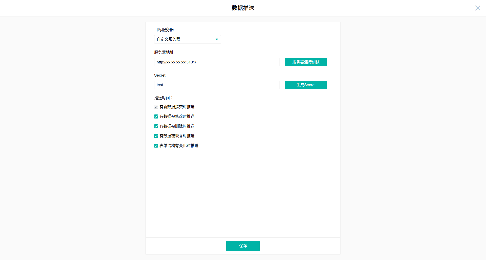
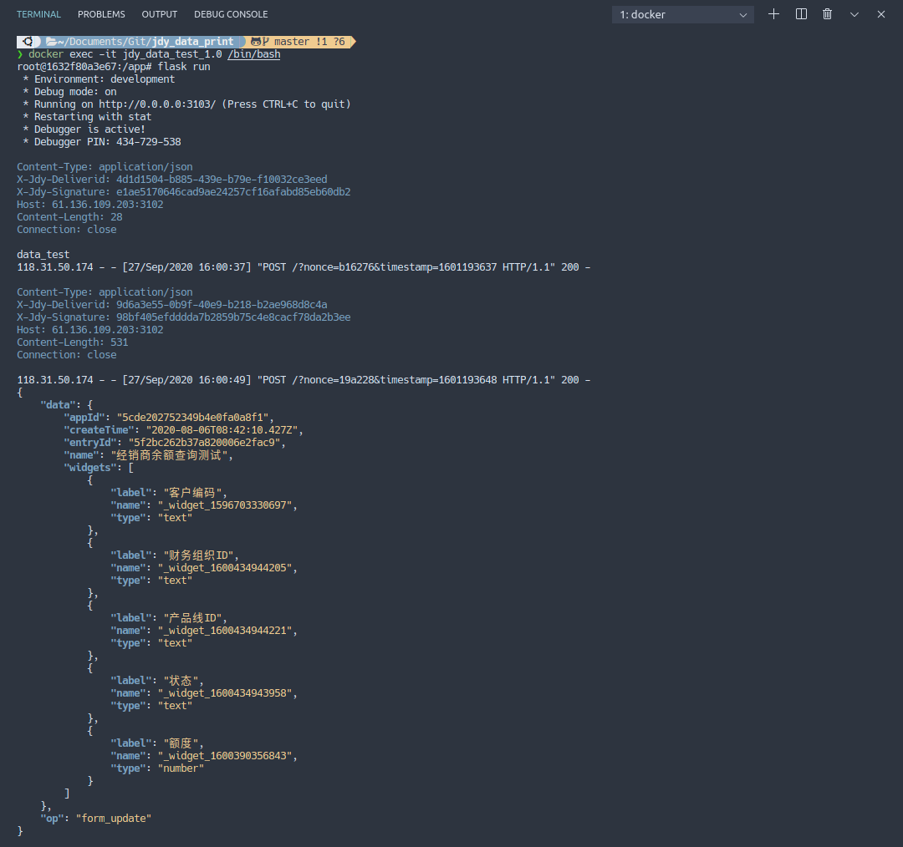
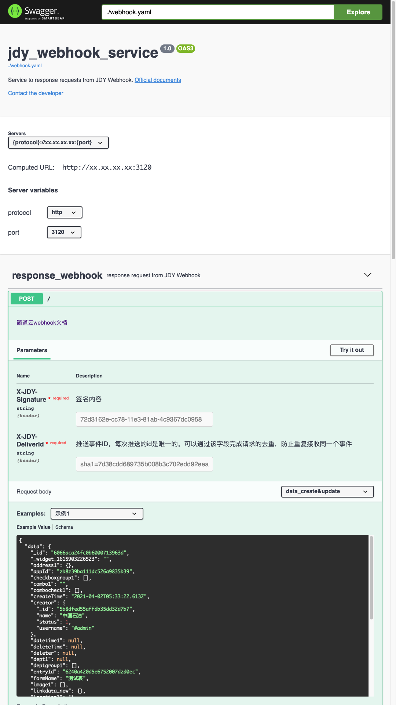

# jdy_data_print


<!-- TABLE OF CONTENTS -->
## Table of Contents

* [About the Project](#about-the-project)
  * [Architecture](#architecture)
  * [Files Structure](#files-structure)
* [Getting Started](#getting-started)
  * [Prerequisites](#prerequisites)
  * [Installation](#installation)
* [Usage](#usage)
  * [Run app](#run-app)
  * [Set jdy](#set-jdy)
  * [Receive data](#receive-data)
  * [Swagger UI](#swagger-ui)
* [To-Do](#To-Do)
* [License](#license)

<!-- ABOUT THE PROJECT -->
## About the Project
Print data from '简道云' API and Webhook, to help you understand the data structure you have got from '简道云'. There are two mainly data source:
- [API](https://hc.jiandaoyun.com/open/10992)(waitting for a further update...)
- [Webhook](https://hc.jiandaoyun.com/open/11500)

Due to the excessive amount of redundant information on the website, I extract the main information(data structure) into file followed OpenAPI Spec V 3.0.3, and render it through Swagger UI. Swagger file has not content API yet.
- [API](https://hc.jiandaoyun.com/open/10992)(waitting for a further update...)
- Webhook
  - [data push](https://hc.jiandaoyun.com/open/10732)
  - [form push](https://hc.jiandaoyun.com/open/11501)
  - [message push](https://hc.jiandaoyun.com/open/11497)

Project Characteristic:

- Docker-based Deployment
- Flask
- Swagger UI
- OpenAPI Specification Version 3.0.3

### Architecture
* Ubuntu 20.04 : Operating System
* Python 3.6+ : Language
* Flask 1.1.2+: third-party library to serve the application
* Pygments: third-party library to colorful output json

### Files Structure
```
.
├── Dockerfile
├── LICENSE
├── README.md
├── app.py
├── docker-compose.yml
├── receive_data.png
├── requirements.txt
├── set_jdy.png
├── swagger-ui.png
└── webhook.yaml

0 directories, 10 files

-------------------------------------------------------------------------------
Language                     files          blank        comment           code
-------------------------------------------------------------------------------
YAML                             2             27              3            874
Markdown                         1             21              0             98
Python                           1              7              6             48
Dockerfile                       1              5              7             20
-------------------------------------------------------------------------------
SUM:                             5             60             16           1040
-------------------------------------------------------------------------------
```

<!-- GETTING STARTED -->
## Getting Started

### Prerequisites
- 64bit Linux like Ubuntu, CentOS etc.
- [Docker](https://docs.docker.com/engine/install/ubuntu/)
- [docker-compose](https://docs.docker.com/compose/install/)

### Installation

1. ssh to remote server if local pass this step
```sh
>>> ssh xx@xx.xx.xx.xx
```
2. Clone the repo
```sh
>>> git clone https://github.com/MacwinWin/jdy_data_print.git
```
3. up services
```sh
>>> docker-compose up -d
```

<!-- USAGE EXAMPLES -->
## Usage
### run app
```sh
# enter the container
>>> docker exec -it jdy_data_print_1.0 /bin/bash
# run app(defult host is 0.0.0.0, port is 3101, development environment is open)
>>> flask run
```

### set jdy

- xx.xx.xx.xx is your host ip
- Default port is 3101, you can modify it
- Default secret is 'test', you can modify it
- All push time is supported

<p align="center">
    

### receive data
Formatted and colorful json print
<p align="center">
    

### swagger ui
visit: http://127.0.0.1:18081
<p align="center">
    

note: Different widgets in same data format may be have different empty data. For example, widget 'datetiem' and widget 'text' have the same data format 'sting', but the empty data of 'datetime' is 'null', and 'text' is "''".

## To-Do
- [x] Add Swagger file
- [ ] Support API data

<!-- LICENSE -->
## License

Distributed under the MIT License. See `LICENSE` for more information.